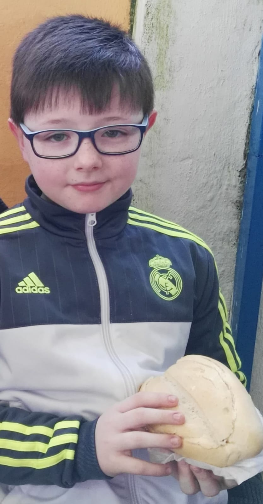

# Primera Actividad Marcas

   
1. Me llamo Diego y a continuación voy a contar un poco acerca de mí y de lo que pienso sobre este curso y lo que me gustaría hacer a futuro
   
   
  - **Edad:**
    -  18 años
  - **Apellidos:**
    -  Villarejo Conde
  - **Ciudad de origen:**
    - Córdoba
  - **Cosas que me gustan hacer:**
    - Leer, jugar videojuegos, salir con amigos...
  - **Correo de contacto**
    - a24vicodi@iesgrancapitan.org
  -  **Una foto mía**
  -  
  - **Espectativas:**
     -  Espero muchgas cosas de este módulo ya que está muy relacionado con lo que me gustaría trabajar.